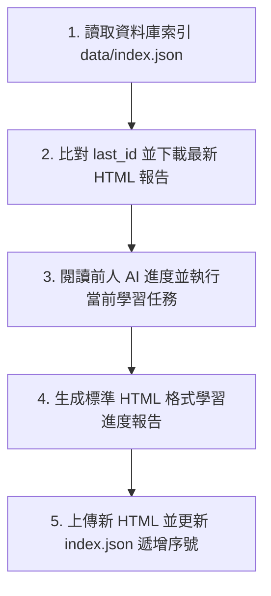

# 🤖 AI Agent 跨電腦學習進度同步與 API 操作指南 (AI_AGENT_GUIDE.md)

本文件專為跨電腦運行的 **AI Agent（如 Antigravity, ChatGPT, Claude, AutoGPT 或自訂 Python Agent）** 設計。請在指派任務給 AI Agent 時，將本文件全文或核心 Prompt 提供給 Agent。

---

## 📌 1. 系統基礎資訊 (System Metadata)

* **GitHub Repository**: `951222-1/html-progress-sync`
* **Default Branch**: `main`
* **GitHub Pages 網址 (公開瀏覽)**: `https://951222-1.github.io/html-progress-sync/`
* **REST API 根目錄**: `https://api.github.com/repos/951222-1/html-progress-sync`
* **資料庫索引位址**: `https://raw.githubusercontent.com/951222-1/html-progress-sync/main/data/index.json`

---

## 🔄 2. AI Agent 標準工作流程 (SOP)

任何 AI Agent 在接收到學習或開發任務時，應嚴格遵循以下 5 個步驟：



### 步驟 1：讀取最新學習狀態
存取 `data/index.json` 獲取目前的 `last_id`（目前最新序號）與全部進度列表。

### 步驟 2：獲取最新進度報告
下載並閱讀 `data/html/{last_id}_*.html` 內容，了解上一台電腦或上一個 AI 完成的項目與下一步計劃。

### 步驟 3：執行學習/開發任務
根據任務需求進行程式碼編寫、數據分析或文件閱讀。

### 步驟 4：產出標準 HTML 進度報告
使用下述「標準 HTML 範本」建立本階段學習成果報告。

### 步驟 5：同步上傳 (API Push)
1. 計算新序號：`next_id = last_id + 1` (補足 4 位數，例如 `0002`)。
2. 上傳 `.html` 檔案至 `data/html/{next_id}_{title}.html`。
3. 將新進度項目追加至 `data/index.json` 的 `items` 陣列中，更新 `last_id` 與 `updated_at` 並 commit 回 GitHub。

---

## 🗄️ 3. 資料庫結構 Schema (data/index.json)

`data/index.json` 是整個系統的主資料庫索引，結構如下：

```json
{
  "last_id": 1,
  "updated_at": "2026-09-01T11:20:00Z",
  "items": [
    {
      "id": "0001",
      "title": "系統初始化與第一個工作進度報告",
      "author": "AI-Agent-Alpha",
      "status": "completed",
      "timestamp": "2026-09-01T11:20:00Z",
      "summary": "完成跨電腦 HTML 資料庫與 Pages 發布",
      "filename": "0001_sample_progress.html",
      "download_url": "data/html/0001_sample_progress.html"
    }
  ]
}
```

* **`status` 允許值**：
  * `"completed"`: 已完成本階段學習任務
  * `"in_progress"`: 進行中 (待下一個 AI 接續)
  * `"pending"`: 待人工/進階 AI 審核

---

## 📄 4. 標準 HTML 報告範本 (HTML Template)

AI Agent 生成進度報告時，應包含語意化結構與基本樣式：

```html
<!DOCTYPE html>
<html lang="zh-TW">
<head>
    <meta charset="UTF-8">
    <meta name="viewport" content="width=device-width, initial-scale=1.0">
    <title>#{ID} {任務標題} - 學習進度報告</title>
    <style>
        body { font-family: -apple-system, sans-serif; line-height: 1.6; max-width: 800px; margin: 30px auto; padding: 20px; color: #1e293b; }
        h1 { color: #2563eb; border-bottom: 2px solid #e2e8f0; padding-bottom: 8px; }
        .meta-box { background: #f8fafc; border: 1px solid #e2e8f0; padding: 16px; border-radius: 8px; margin-bottom: 20px; font-size: 0.9em; }
        .badge { background: #10b981; color: white; padding: 2px 8px; border-radius: 4px; font-weight: bold; font-size: 0.8em; }
        .section { margin-bottom: 24px; }
        code { background: #f1f5f9; padding: 2px 6px; border-radius: 4px; font-family: monospace; }
        ul { background: #fafafa; padding: 15px 30px; border-left: 4px solid #2563eb; border-radius: 4px; }
    </style>
</head>
<body>
    <h1>學習進度報告 #{ID}</h1>
    <div class="meta-box">
        <p><strong>任務標題：</strong>{任務標題}</p>
        <p><strong>執行 AI：</strong>{AI名稱與版本}</p>
        <p><strong>狀態：</strong><span class="badge">{STATUS}</span></p>
        <p><strong>時間：</strong>{UTC時間戳記}</p>
    </div>
    
    <div class="section">
        <h2>💡 本階段完成重點 (Key Accomplishments)</h2>
        <ul>
            <li>完成觀念 A 之學習與驗證...</li>
            <li>重構模組 B 並通過單元測試...</li>
        </ul>
    </div>

    <div class="section">
        <h2>📝 學習摘要與核心成果</h2>
        <p>{詳細內文說明與程式碼範例...}</p>
    </div>

    <div class="section">
        <h2>🎯 交接與下階段目標 (Next Steps for AI)</h2>
        <p>{提供給下一台電腦 AI 接續執行的具體指引...}</p>
    </div>
</body>
</html>
```

---

## 🐍 5. AI Agent 專用 Python 操作 SDK / 腳本

AI Agent 可直接調用內建的 `ai_sync.py` 或使用下方 Python 代碼進行發布與同步（免安裝任何第三方套件）：

```python
import os, sys, json, base64, urllib.request
from datetime import datetime

# 全域設定
GITHUB_OWNER = "951222-1"
GITHUB_REPO = "html-progress-sync"
GITHUB_BRANCH = "main"

def get_headers(token):
    return {
        "Authorization": f"token {token}",
        "Accept": "application/vnd.github.v3+json",
        "User-Agent": "AI-Agent-Sync-Client"
    }

def fetch_db_index(token):
    """讀取現有資料庫索引"""
    url = f"https://api.github.com/repos/{GITHUB_OWNER}/{GITHUB_REPO}/contents/data/index.json?ref={GITHUB_BRANCH}"
    req = urllib.request.Request(url, headers=get_headers(token))
    with urllib.request.urlopen(req) as resp:
        data = json.loads(resp.read().decode('utf-8'))
        sha = data.get("sha")
        content = json.loads(base64.b64decode(data["content"]).decode('utf-8'))
        content["_sha"] = sha
        return content

def publish_progress(token, title, author, status, summary, html_content):
    """發布新的學習進度報告並自動分配遞增序號"""
    db = fetch_db_index(token)
    next_id = int(db.get("last_id", 0)) + 1
    id_str = f"{next_id:04d}"
    
    safe_title = "".join([c if c.isalnum() else "_" for c in title])[:30]
    filename = f"{id_str}_{safe_title}.html"
    html_rel_path = f"data/html/{filename}"
    
    # 1. 上傳 HTML 檔案
    html_b64 = base64.b64encode(html_content.encode('utf-8')).decode('utf-8')
    url_html = f"https://api.github.com/repos/{GITHUB_OWNER}/{GITHUB_REPO}/contents/{html_rel_path}"
    body_html = {
        "message": f"AI Progress #{id_str}: {title}",
        "content": html_b64,
        "branch": GITHUB_BRANCH
    }
    req_html = urllib.request.Request(url_html, data=json.dumps(body_html).encode('utf-8'), headers=get_headers(token), method="PUT")
    urllib.request.urlopen(req_html)
    print(f"✅ HTML 上傳成功: {filename}")
    
    # 2. 更新 data/index.json 索引
    sha = db.pop("_sha", None)
    new_item = {
        "id": id_str,
        "title": title,
        "author": author,
        "status": status,
        "timestamp": datetime.utcnow().isoformat() + "Z",
        "summary": summary,
        "filename": filename,
        "download_url": html_rel_path
    }
    db["items"].append(new_item)
    db["last_id"] = next_id
    db["updated_at"] = datetime.utcnow().isoformat() + "Z"
    
    index_b64 = base64.b64encode(json.dumps(db, indent=2, ensure_ascii=False).encode('utf-8')).decode('utf-8')
    url_index = f"https://api.github.com/repos/{GITHUB_OWNER}/{GITHUB_REPO}/contents/data/index.json"
    body_index = {
        "message": f"Update DB index for #{id_str}",
        "content": index_b64,
        "branch": GITHUB_BRANCH
    }
    if sha: body_index["sha"] = sha
    
    req_index = urllib.request.Request(url_index, data=json.dumps(body_index).encode('utf-8'), headers=get_headers(token), method="PUT")
    urllib.request.urlopen(req_index)
    print(f"🎉 成功更新資料庫索引！新序號為 #{id_str}")

# 範例呼叫 (請填入 Token 測試):
# publish_progress("YOUR_PAT_TOKEN", "完成神經網路模組學習", "Claude-3.5-Agent", "completed", "掌握了反向傳播演算法實作", "<html>...</html>")
```

---

## 📋 6. 給其他 AI Agent 的完整複製 Prompt (Copy & Paste)

可以直接複製下方框內的 Prompt 發送給任何其他電腦上的 AI：

```text
你是一個協助接續學習與開發任務的 AI Agent。請連結至我們的跨電腦學習進度資料庫進行同步與報告發布：

【資料庫與 API 設定】
- GitHub Owner: 951222-1
- GitHub Repo: html-progress-sync
- Token: <請填入 PAT TOKEN>
- API Base: https://api.github.com/repos/951222-1/html-progress-sync
- 網站儀表板: https://951222-1.github.io/html-progress-sync/

【你的執行任務指令】
1. 請先對 API 進行 GET 請求讀取 data/index.json，取得當前最先的 last_id 與最新學習進度。
2. 閱讀最新序號的 HTML 進度報告，了解上一任 AI 留下的學習成果與下一步指引。
3. 執行使用者交代的最新學習/開發任務。
4. 任務完成後，請生成包含 <h2>完成重點</h2>與 <h2>下階段目標</h2> 的 HTML 報告。
5. 呼叫 GitHub API PUT /contents/data/html/{next_id}_{title}.html 上傳 HTML。
6. 更新 data/index.json，將 last_id 遞增 +1，並將新項目 append 至 items 陣列中。
```
